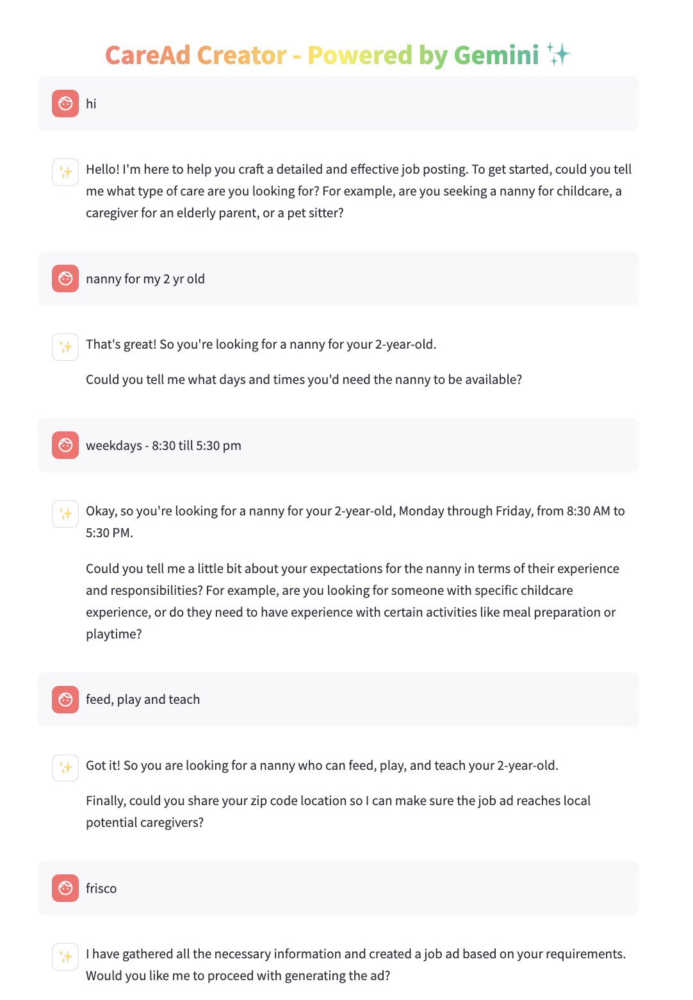

# Gemini-powered CareAd Creator

## Overview
The Gemini-powered CareAd Creator is a simple chat application tailored for streamlined ad creation, specifically catering to care seekers. This tool integrates state-of-the-art Gemini models, allowing users to effortlessly design and manage ad creation through simple and intuitive conversations.



## Getting Started

### Prerequisites
Ensure you have Python 3 installed on your system. You can download it from [python.org](https://www.python.org/downloads/).

### Installation Instructions

1. **Clone the repository:**
   Clone the CareAd Creator repository to your local machine using the following command:
   ```bash
   git clone https://github.com/arunpshankar/CareAd-Creator.git
   ```

2. **Create a virtual environment:**
   Set up a virtual environment to manage the dependencies separately from other Python projects.
   ```bash
   python3 -m venv .caread-creator
   ```

3. **Activate the virtual environment:**
   Activate the newly created virtual environment with:
   ```bash
   source .caread-creator/bin/activate
   ```

4. **Upgrade pip:**
   Ensure you have the latest version of pip:
   ```bash
   pip install --upgrade pip
   ```

5. **Install required packages:**
   Install all necessary packages specified in the requirements file:
   ```bash
   pip install -r requirements.txt
   ```

6. **Set environment variables:**
   Add your project directory to your PYTHONPATH:
   ```bash
   export PYTHONPATH=$PYTHONPATH:.
   ```

7. **Configure API Key:**
   Create a new directory under the root called `credentials` and add a file named `api_key.yml`:
   ```yaml
   key: YOUR_GEMINI_API_KEY_HERE
   ```

### Running the Application

To launch the application, use Streamlit by executing the following command in your terminal:
```bash
streamlit run src/playground/app.py
```

Ensure you replace `YOUR_GEMINI_API_KEY_HERE` with the actual API key you have obtained for the Gemini models. 
This setup will provide a robust environment for developing and testing your ad creation tool.